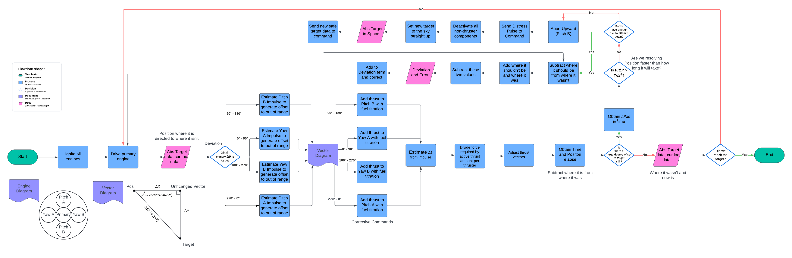

# SE-Rocketry
A work-in-progress learning environment for Rocketry in Space Engineers, as well as encoding procedures used in Linear Binary Codes, this project is meant to help me stay sharp and keep practicing my skills while following the SSDLC.

Phase: DESIGN

## Diagrams

